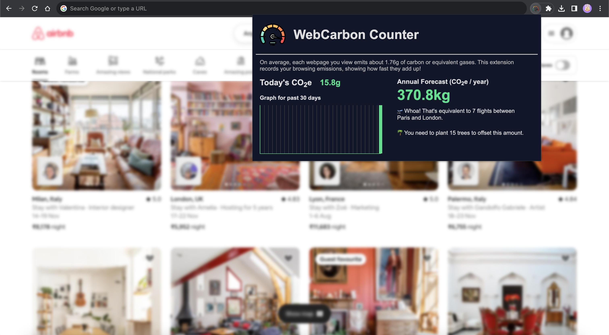
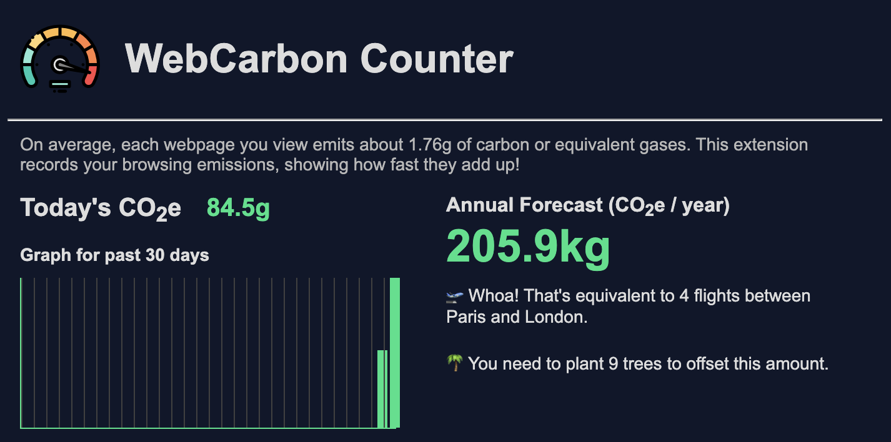

# WebCarbon

With every web page generating 1.76g of carbon emissions, the cumulative effect of our online activities becomes a significant environmental concern. it's an energy-hungry colossus, 
consuming over 416.2 TWh annually—surpassing the entire electricity consumption of the United Kingdom.

`WebCarbon` is a Chrome Browser extension, designed for tracking and calculating the CO2e emissions from your daily browsing, offering a real-time audit of your digital carbon footprint.

## 🌐 Table of Contents

- [Background](#-background)
- [Features](#-features)
- [Getting Started](#-getting-started)
- [Usage](#-usage)
- [Algorithms Used](#-algorithms-used)
- [Built Using](#%EF%B8%8F-built-using)
- [Improvements](#%EF%B8%8F-improvements)
- [Contributors](#-contributors)

## 📜 Background

The inspiration for this project lies in a realization that the Internet's carbon footprint rivals that of the global aviation industry. 
Data centres, transmission networks, and the billions of devices we use are steadily guzzling electricity, primarily sourced from fossil fuels. 

This project hopes to spark conversations about the sustainability of the internet and the steps we can take to reduce our online carbon footprint. 
With data on energy consumption by websites, users can more informed decisions by understanding the real weight of their online activities in carbon emissions 
and be part of a solution that aims for a greener internet.

`Because the internet shouldn't cost the earth.`

## 🚀 Features

1. Tracks ⏱️ real-time CO2e emissions from daily web browsing.
2. Displays a 30-day graph 📊 of your browsing emissions.
3. Offers an annual CO2e emission forecast 🌧️ using average carbon emissions data (till date).
4. Compares annual emissions to an equivalent number of flights 🛫.
5. Suggest the number of trees 🌴 to plant to offset emissions.

## 🏁 Getting Started

### Prerequisites

- [Chrome Browser](https://www.google.com/intl/en_in/chrome/): To spin up this extension.
- [Command Line](): To clone this repo.

### Installation & Configuration

1. **Clone the Repo**  
   `git clone https://github.com/abhishek-x/web-carbon.git`

2. **Go to the Extensions page** by entering `chrome://extensions` in a new tab or, click the Chrome menu, hover over `More Tools`, then select Extensions.

3. **Enable Developer Mode** by clicking the toggle switch next to `Developer mode`.

4. **Unpack Extension** by clicking the `Load unpacked` button and selecting the extension directory.
   

6. **Pin this Extension (Optional)**: Pin your extension to the toolbar to quickly access your extension.
   

## 🎈 Usage

- Browse the web as usual, and the extension will track the energy consumption of each website visited.
- Access WebCarbon by clicking on the extension icon in the Chrome browser toolbar.

## 📝 Algorithms Used
1. **Daily Carbon Emission Calculation:** This calculates the carbon emissions for the current day by multiplying the number of pages viewed today (`dayCount`)
   by the average carbon emissions per page view (`carbonPerPage`).

   `todayCarbon = dayCount * carbonPerPage`
   
2. **Average Daily Carbon Emission and Annual Forecast:** This calculates the average daily carbon emissions based on past data (`sum` of emissions over `days`) and
   then projects it to an annual scale.
   
   `average daily carbon: avgDay = sum / days`
   
   `annual forecast: annualEmission = avgDay * 365`

4. **Comparison to Flights and Trees Required:** This compares the annual forecasted emissions to the equivalent number of flights between Paris and London (`flight`)
   and calculates the number of trees required to offset the annual emissions (`treesNeeded`).
   
   `flightsEquivalent = annualEmission / flight`
   
   `treesNeeded = annualEmission / trees`

   The `sum` variable aggregates the total carbon for the `days` counted, and days keep track of the number of days with more than zero emissions. 

## ⛏️ Built Using

`HTML`, `CSS`, `JavaScript`, `LocalStorage API`, `Chrome Manifest V2`

## 🗺️ Improvements 

1. Migrate extension from **Manifest V2 to Manifest V3.**
2. Publish WebCarbon extension on **Chrome Web Store.**

## 👥 Contributors

<table>
  <tr>
    <td align="center"><a href="https://github.com/abhishek-x"> <b>Abhishek Aggarwal</b></a> </td>
  </tr>
</table>
